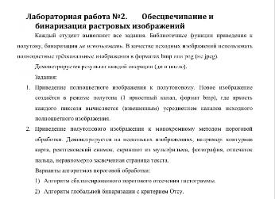

# Семинары по обработке аудио визуальной информации #

## Культура Форков
Мы организуем процесс следующим образом, каждый студент, который планирует сдать лабораторные работы, делает форк от [основного репозитория](https://github.com/nilgorithm/semOavi).

К примеру так: 
```bash
git remote add upstream git@github.com:nilgorithm/semOavi.git
```
Название веток должны быть нативно понятными, поэтому сделаем их как "**ivanovii_B21_504**" от исходного "**_Иванов Иван Иванович Б21-504_**". Внизу они нагенерены, если у вас появилось ощущение, что вы не можете найти себя - пингуйте.

Ваша задача будет в папку results по каждому семинару подгружать результаты выполнения лабораторных работ. Структура будет следующей: 
1) Вы делаете сабдиректории c названиями индексов заданий, к примеру для этой лабы:  <br> Будет всего две папки с названиями **"1"** и **"2"** соответственно. В папке **"1"** лежит проект по **_"Приведению  полноцветного  изображения  к  полутоновому"_**, а в папке **"2.5"** соотвествтенно тот проект, который я на вас распределил, к примеру это будет **_"5 Алгоритм адаптивной бинаризации Эйквил."_**. <br> ***ВАЖНО**! Если у задания есть свой саб индекс - названием папки оформляется по принципу номер задание/разделитель/индекс, то есть в случае с Эйквил название папки **"2"** будет **"2.5"**. 
2) Также вы делаете две подпапки с названиями "input" и "output" в папках **"1"** и **"2"** соответственно. В "input" лежат исходные изображения, в "output" результат вашей обработки. <br> **ВАЖНО** "input" и "output" должны представлять из себя биективное соответствие, то есть к примеру файлику example1.png из папки input должен быть соотнесен файлик example1.png из папки output.
3) В самих "индекс" папках вы делаете два файла. Первый это ваш .ipynb проект, но он не является обязательным. Второй файл .py, который является обязательным и запускается по стандартному принципу: <br>`if __name__ == "__main__": ` <br> &nbsp;&nbsp;&nbsp;&nbsp;&nbsp;&nbsp;&nbsp;&nbsp;&nbsp;&nbsp;&nbsp;&nbsp;&nbsp;&nbsp;&nbsp;&nbsp; `main(smth or None)` <br> 
4) Делать тесты не обязательно, но поощрительно, к примеру при помощи pytest. Допустимо использование путей с исходными изображниями в цикле. К примеру у вас есть файлы `["2sem/results/1/input/im1.png", "2sem/results/1/input/im1.png", "2sem/results/1/input/im1.png"]`. В таком случае ваш `main()` в цикле запускает функцию с названием метода, который вы используете, к примеру это `otsu(img_path)` (Алгоритм глобальной бинаризации с критерием Отсу) и результаты записываются в папочку "output" наример с префиксом "res_" (`["2sem/results/1/input/res_im1.png", ...]`). <br> **ВАЖНО**! Используйте пути по принципу relative path, то есть открывая весь проект, ваши .py файлы не должны давать ошибку `FileNotFoundError`. Пример для файла main.py в 2.2 директории путь к файлам инпута должны быть вида `2sem/results/1/output/im1.png`. Для удобства советую использовать модуль `glob`. 


Каждую неделю репозиторий будет обновляться => необходимо будет подгружать новые материалы (я решил для удобства вам также оставлять лабу в корне папки с индексом прошедшего семинара). Обновлять материалы можно будет так:
```bash
git fetch upstream
```

В папке results/EXAMPLE второго семинара будет представлен пример c вышеописанной структурой. На всякий случай еще тут оставлю [link](https://github.com/nilgorithm/semOavi/tree/master/2sem/results/EXAMPLE). Пример предполагает, что на студента была распределен "Алгоритм глобальной бинаризации с критерием Отсу". Пользоваться средствами opencv как в примере **нельзя**. 

## Название форка под каждого студента

biletovmd_B21_504
kondrashkinas_B21_504
kulikovdi_B21_504
mironovatv_B21_504
pavlovdg_B21_504
pokroyaa_B21_504
popovza_B21_504
stegniyiv_B21_504
ulyanovev_B21_504
khalilulinrm_B21_504
shnyakinde_B21_504
belyakovkg_B21_514
varlamovai_B21_514
lutsenkosа_B21_514
sirodjevas_B21_514
antonovna_B21_524
apalkovama_B21_524
belovapo_B21_524
vasilevfn_B21_524
gorlovms_B21_524
gubarevso_B21_524
kovorotnysd_B21_524
legkoduhka_B21_524
matveevpd_B21_524
merkulovdv_B21_524
parkhomenkodo_B21_524
petrosyanss_B21_524
pischikovnp_B21_524
sedinkinma_B21_524
starodubtsevaa_B21_524
sukhininаа_B21_524
tsibikovma_B21_524
chvanovaes_B21_524
shishkinna_B21_524
al-alushia_B21_564
batsaihans_B21_564
bloshenkinaaa_B21_564
nguyentm_B21_564
tivariss_B21_564
shobichr_B21_564

*Совет - использовать vscode (потому что кроссплатформенность), на который стоит поставить плагин: [Markdown+Math](https://marketplace.visualstudio.com/items?itemName=goessner.mdmath). Т.к. в jupyter сделаны вставки md с katex и LaTeX разметкой.